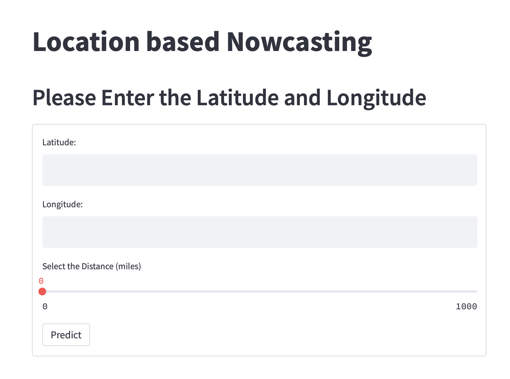
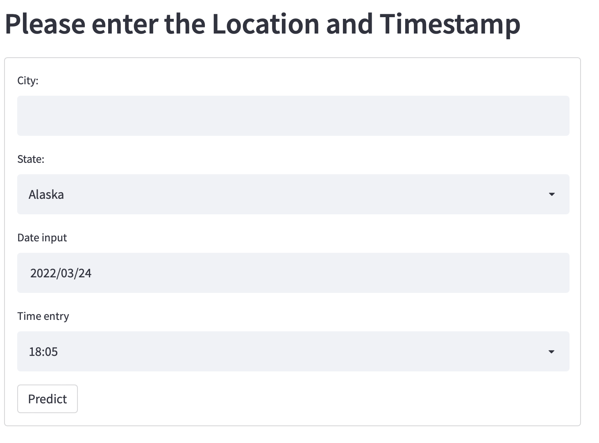

# Streamlit

## Web Application - Location based Nowcasting

In this Application, we are generating the predicted images using the nowcast model using an API. As you can see below the application asks the user to input either Latitude & Longitude along with the distance based on how far they want to see the storm prediction. 

Another approach to view the predicted images are by giving the input of City, State, Date, and Time. Post giving the input we can generate the images using the nowcast model by calling it via an API.

The predicted Images are shown as such
